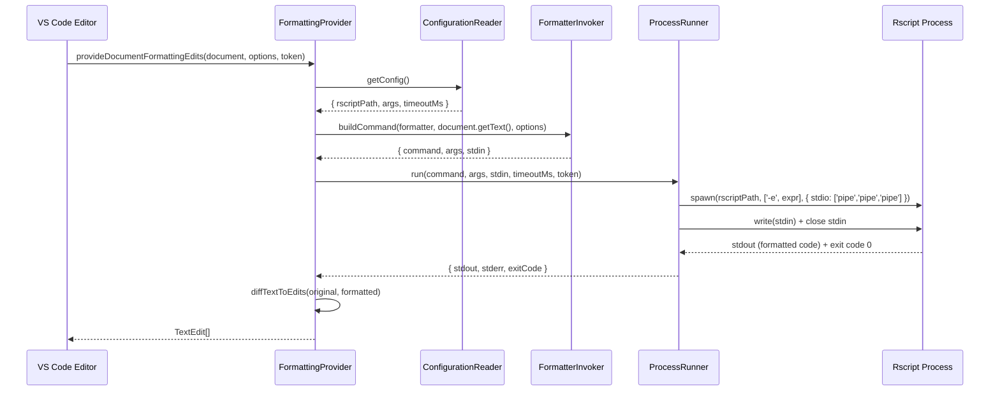
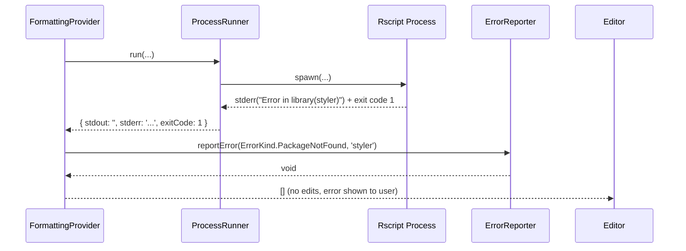

# Design Document: R Formatter VS Code Extension

## Overview

This extension integrates the `styler` R formatter into VS Code by registering a `DocumentFormattingEditProvider` for the `r` language. When the user triggers "Format Document" or Format on Save, the extension invokes `styler` via a subprocess call to `Rscript`, captures the formatted output, and returns the edits to VS Code.

The extension is intentionally thin: it delegates all formatting logic to a well-maintained R package and focuses on reliable process management, configuration, and error surfacing. No bundled R runtime or formatter is included — the user's globally installed R environment is used.

The design is structured in two layers: a high-level architecture view describing components and their contracts, followed by a low-level view with formal algorithm specifications, pseudocode, and data type definitions.

---

## Architecture

```mermaid
graph TD
    A[VS Code Editor] -->|Format Document / Format on Save| B[Extension Host]
    B --> C[FormattingProvider]
    C --> D[ConfigurationReader]
    C --> E[FormatterInvoker]
    E --> F[ProcessRunner]
    F -->|Rscript subprocess| G[R Runtime]
    G --> H[styler package]
    H -->|stdout: formatted code| F
    F -->|stdout / exit code| E
    E -->|FormattingResult| C
    C -->|TextEdit[]| A
    C --> I[ErrorReporter]
    I -->|vscode.window.showErrorMessage| A
```

### Component Responsibilities

| Component | Responsibility |
|-----------|---------------|
| `FormattingProvider` | Implements the VS Code `DocumentFormattingEditProvider` interface; orchestrates the format flow |
| `ConfigurationReader` | Reads workspace/user settings from `vscode.workspace.getConfiguration` |
| `FormatterInvoker` | Builds the `styler`-specific R command string and stdin payload |
| `ProcessRunner` | Spawns `Rscript` subprocess; manages stdin/stdout/stderr; handles timeouts |
| `ErrorReporter` | Translates error conditions into user-visible VS Code notifications |

---

## Sequence Diagrams

### Format Document (stdin/stdout mode)



### Error Path — Package Not Installed



---

## Components and Interfaces

### FormattingProvider

**Purpose**: VS Code integration point; the only component that directly calls VS Code APIs.

**Interface**:
```typescript
interface FormattingProvider
  extends vscode.DocumentFormattingEditProvider {

  provideDocumentFormattingEdits(
    document: vscode.TextDocument,
    options: vscode.FormattingOptions,
    token: vscode.CancellationToken
  ): Promise<vscode.TextEdit[]>
}
```

**Responsibilities**:
- Read current document text
- Delegate to `FormatterInvoker` and `ProcessRunner`
- Convert raw formatted text into `vscode.TextEdit[]` via a full-document replacement
- Catch all errors and route to `ErrorReporter`
- Respect cancellation token (abort subprocess on cancel)

---

### ConfigurationReader

**Purpose**: Single point of truth for extension settings.

**Interface**:
```typescript
interface ExtensionConfig {
  rscriptPath: string          // default: 'Rscript'
  stylerScope: 'file' | 'text' // default: 'text'
  timeoutMs: number            // default: 30000
}

interface ConfigurationReader {
  getConfig(): ExtensionConfig
}
```

**Responsibilities**:
- Call `vscode.workspace.getConfiguration('rFormatter')` on each format request (picks up live changes)
- Provide typed defaults for every field

---

### FormatterInvoker

**Purpose**: Encodes formatter-specific R expression strings; no process management.

**Interface**:
```typescript
interface InvokeSpec {
  rscriptPath: string
  args: string[]       // passed as-is to spawn()
  stdin: string | null // null means no stdin needed
}

interface FormatterInvoker {
  buildInvokeSpec(
    config: ExtensionConfig,
    documentText: string
  ): InvokeSpec
}
```

**Responsibilities**:
- For `styler`: build `Rscript -e "con<-file('stdin');cat(styler::style_text(readLines(con)), sep='\n')"`
- Escape single quotes in document text before embedding in expression (or use file-path mode for large files)

---

### ProcessRunner

**Purpose**: Spawn subprocess; return a plain result object; no VS Code dependencies.

**Interface**:
```typescript
interface ProcessResult {
  stdout: string
  stderr: string
  exitCode: number
}

interface ProcessRunner {
  run(
    command: string,
    args: string[],
    stdin: string | null,
    timeoutMs: number,
    token: vscode.CancellationToken
  ): Promise<ProcessResult>
}
```

**Responsibilities**:
- Use Node.js `child_process.spawn` (not `exec`) to avoid shell injection
- Write `stdin` to process stdin when provided, then close the write stream
- Collect all stdout/stderr chunks into buffers
- Reject with `TimeoutError` if the process exceeds `timeoutMs`
- Kill the process and resolve with a cancellation result when `token.isCancellationRequested`

---

### ErrorReporter

**Purpose**: Map error conditions to user-visible messages.

**Interface**:
```typescript
const enum ErrorKind {
  RscriptNotFound,
  PackageNotFound,
  FormattingFailed,
  Timeout,
  Cancelled,
}

interface ErrorReporter {
  report(kind: ErrorKind, detail?: string): void
}
```

**Responsibilities**:
- Show `vscode.window.showErrorMessage` with actionable text
- For `RscriptNotFound`: link to R installation docs
- For `PackageNotFound`: show install command (`install.packages('styler')`)
- For `FormattingFailed`: include stderr excerpt in the message

---

## Data Models

### ExtensionConfig

```typescript
interface ExtensionConfig {
  rscriptPath: string
  stylerScope: 'file' | 'text'
  timeoutMs: number
}
```

**Validation Rules**:
- `rscriptPath` must be a non-empty string; falls back to `'Rscript'` (relies on PATH)
- `timeoutMs` must be a positive integer; clamped to `[1000, 300000]`

### ProcessResult

```typescript
interface ProcessResult {
  stdout: string    // UTF-8 decoded combined output
  stderr: string    // UTF-8 decoded error stream
  exitCode: number  // process exit code; -1 for timeout/cancel
}
```

---

## Key Functions with Formal Specifications

### `provideDocumentFormattingEdits`

```typescript
async function provideDocumentFormattingEdits(
  document: vscode.TextDocument,
  options: vscode.FormattingOptions,
  token: vscode.CancellationToken
): Promise<vscode.TextEdit[]>
```

**Preconditions**:
- `document.languageId === 'r'`
- `document.getText()` returns a valid UTF-8 string (may be empty)
- `token` is a live cancellation token

**Postconditions**:
- Returns `[]` on any error (never rejects; errors are shown via `ErrorReporter`)
- Returns `[]` when formatted text equals original text
- Returns a single full-document `TextEdit` replacing the entire content when text differs
- Does not mutate `document`

**Loop Invariants**: N/A (no explicit loops)

---

### `ProcessRunner.run`

```typescript
async function run(
  command: string,
  args: string[],
  stdin: string | null,
  timeoutMs: number,
  token: vscode.CancellationToken
): Promise<ProcessResult>
```

**Preconditions**:
- `command` is a non-empty string (resolved binary path or name on PATH)
- `args` contains no shell metacharacters (passed directly to `spawn`, not a shell)
- `timeoutMs > 0`

**Postconditions**:
- If process exits with code 0: `result.exitCode === 0`, `result.stdout` contains all output
- If process exits with non-zero: `result.exitCode !== 0`, `result.stderr` contains error details
- If timeout expires: process is `SIGKILL`ed, `result.exitCode === -1`
- If token cancelled before completion: process is `SIGKILL`ed, `result.exitCode === -1`
- `stdout` and `stderr` are always strings (never `null`)

---

### `buildInvokeSpec` (styler)

```typescript
function buildInvokeSpec(
  config: ExtensionConfig,
  documentText: string
): InvokeSpec
```

**Preconditions**:
- `config.rscriptPath` is a non-empty string
- `documentText` is a string (may be empty)

**Postconditions**:
- Returns `InvokeSpec` where `stdin === documentText`
- `args` contains exactly one `-e` flag followed by a valid R expression
- The R expression reads from `stdin` and writes formatted text to stdout
- No shell quoting vulnerabilities (arguments passed as array, not shell string)

---

## Algorithmic Pseudocode

### Main Formatting Algorithm

```pascal
PROCEDURE provideDocumentFormattingEdits(document, options, token)
  INPUT: document (TextDocument), options (FormattingOptions), token (CancellationToken)
  OUTPUT: edits (TextEdit[])

  BEGIN
    config ← ConfigurationReader.getConfig()

    documentText ← document.getText()

    ASSERT documentText IS String

    invokeSpec ← FormatterInvoker.buildInvokeSpec(config, documentText)

    TRY
      result ← AWAIT ProcessRunner.run(
        invokeSpec.rscriptPath,
        invokeSpec.args,
        invokeSpec.stdin,
        config.timeoutMs,
        token
      )

      IF result.exitCode = -1 THEN
        // Timeout or cancellation — return no edits silently
        RETURN []
      END IF

      IF result.exitCode ≠ 0 THEN
        kind ← classifyError(result.stderr)
        ErrorReporter.report(kind, result.stderr)
        RETURN []
      END IF

      formattedText ← result.stdout

      IF formattedText = documentText THEN
        RETURN []
      END IF

      fullRange ← computeFullDocumentRange(document)
      RETURN [ TextEdit.replace(fullRange, formattedText) ]

    CATCH error
      ErrorReporter.report(ErrorKind.FormattingFailed, error.message)
      RETURN []
    END TRY
  END
END PROCEDURE
```

**Preconditions**:
- Extension is active and `FormattingProvider` is registered for language `'r'`
- `config` contains valid, non-null values for all fields

**Postconditions**:
- Always resolves (never rejects)
- Returns exactly 0 or 1 `TextEdit` elements
- The single edit, when applied, replaces the entire document with `formattedText`

---

### ProcessRunner Subprocess Algorithm

```pascal
PROCEDURE run(command, args, stdin, timeoutMs, token)
  INPUT: command (String), args (String[]), stdin (String | null),
         timeoutMs (Integer), token (CancellationToken)
  OUTPUT: result (ProcessResult)

  BEGIN
    stdoutChunks ← []
    stderrChunks ← []

    proc ← spawn(command, args, { stdio: ['pipe', 'pipe', 'pipe'] })

    IF spawn failed THEN
      RETURN { stdout: '', stderr: 'Rscript not found', exitCode: 1 }
    END IF

    // Feed stdin
    IF stdin ≠ null THEN
      proc.stdin.write(stdin, 'utf8')
    END IF
    proc.stdin.end()

    // Accumulate output
    ON proc.stdout 'data' DO (chunk)
      stdoutChunks.push(chunk)
    END ON

    ON proc.stderr 'data' DO (chunk)
      stderrChunks.push(chunk)
    END ON

    // Timeout watchdog
    timer ← setTimeout(timeoutMs, PROCEDURE
      proc.kill('SIGKILL')
      timedOut ← true
    END PROCEDURE)

    // Cancellation watchdog
    tokenListener ← token.onCancellationRequested(PROCEDURE
      proc.kill('SIGKILL')
    END PROCEDURE)

    // Await process exit
    exitCode ← AWAIT waitForExit(proc)

    clearTimeout(timer)
    tokenListener.dispose()

    IF timedOut OR token.isCancellationRequested THEN
      RETURN { stdout: '', stderr: '', exitCode: -1 }
    END IF

    RETURN {
      stdout: Buffer.concat(stdoutChunks).toString('utf8'),
      stderr: Buffer.concat(stderrChunks).toString('utf8'),
      exitCode: exitCode
    }
  END
END PROCEDURE
```

**Loop Invariants**:
- `stdoutChunks` and `stderrChunks` grow monotonically; no chunk is dropped
- The process is killed at most once (timeout and cancel are mutually exclusive via `timedOut` flag)

---

### Error Classification Algorithm

```pascal
FUNCTION classifyError(stderr)
  INPUT: stderr (String)
  OUTPUT: kind (ErrorKind)

  BEGIN
    IF stderr CONTAINS 'could not find function' OR
       stderr CONTAINS 'there is no package called' OR
       stderr CONTAINS 'Error in library' THEN
      RETURN ErrorKind.PackageNotFound
    END IF

    IF stderr CONTAINS 'cannot open' AND
       stderr CONTAINS 'Rscript' THEN
      RETURN ErrorKind.RscriptNotFound
    END IF

    RETURN ErrorKind.FormattingFailed
  END
END FUNCTION
```

---

### buildInvokeSpec — styler (stdin/stdout mode)

```pascal
FUNCTION buildInvokeSpec(config, documentText)
  INPUT: config (ExtensionConfig), documentText (String)
  OUTPUT: spec (InvokeSpec)

  BEGIN
    rExpr ← "con<-file('stdin');out<-styler::style_text(readLines(con));" +
             "cat(paste(out, collapse='\n'), '\n', sep='')"

    RETURN {
      rscriptPath: config.rscriptPath,
      args: ['--vanilla', '-e', rExpr],
      stdin: documentText
    }
  END
END FUNCTION
```

---

## Example Usage

```typescript
// Extension activation entry point (extension.ts)
export function activate(context: vscode.ExtensionContext): void {
  const configReader = new ConfigurationReader()
  const invoker = new FormatterInvoker()
  const runner = new ProcessRunner()
  const reporter = new ErrorReporter()
  const provider = new FormattingProvider(configReader, invoker, runner, reporter)

  const disposable = vscode.languages.registerDocumentFormattingEditProvider(
    { language: 'r' },
    provider
  )
  context.subscriptions.push(disposable)
}

// package.json contribution (excerpt)
// {
//   "activationEvents": ["onLanguage:r"],
//   "contributes": {
//     "configuration": {
//       "title": "R Formatter",
//       "properties": {
//         "rFormatter.rscriptPath":  { "type": "string", "default": "Rscript" },
//         "rFormatter.timeoutMs":    { "type": "number", "default": 30000 }
//       }
//     }
//   }
// }
```

---

## Correctness Properties

- **Idempotency**: Formatting already-formatted code produces no edits. For all valid R source text `t`, if `format(t) = t'`, then `format(t') = t'`.
- **No data loss**: The full document replacement edit is constructed from the complete formatter output. The original text is never partially applied.
- **No shell injection**: `Rscript` is invoked via `spawn(command, args)` with an explicit args array, never via a shell-interpolated command string.
- **Graceful degradation**: Any non-zero exit or exception from the subprocess results in returning `[]` (no edits) and a user-visible error message, never a VS Code error dialog or silent corruption.
- **Cancellation safety**: If the user cancels (or VS Code cancels due to another format request), the subprocess is killed and the promise resolves with `[]` within one event loop tick after the kill signal.
- **Config freshness**: Configuration is read on every format invocation, so user changes to settings take effect immediately without reloading the window.

---

## Error Handling

### R Not Installed / Rscript Not on PATH

**Condition**: `spawn()` emits `ENOENT` or the configured `rscriptPath` cannot be found.
**Response**: Show error message: "R Formatter: Rscript not found. Install R and ensure Rscript is on your PATH, or set `rFormatter.rscriptPath`."
**Recovery**: User installs R or updates the setting; no extension reload needed.

### Formatter Package Not Installed

**Condition**: Rscript exits non-zero; stderr contains `there is no package called 'styler'` or similar.
**Response**: Show error: "R Formatter: Package 'styler' is not installed. Run `install.packages('styler')` in R."
**Recovery**: User installs package; next format attempt succeeds.

### Formatting Failure (Syntax Error in R File)

**Condition**: Rscript exits non-zero for a reason other than missing package (e.g., the R file contains a syntax error that the formatter cannot process).
**Response**: Show error with first 200 characters of stderr: "R Formatter: Formatting failed — {stderr excerpt}."
**Recovery**: User fixes the syntax error; formatting succeeds on next attempt.

### Timeout

**Condition**: Subprocess does not exit within `timeoutMs` (default 30 s).
**Response**: Subprocess is killed; show warning: "R Formatter: Formatting timed out after 30s."
**Recovery**: User can increase `rFormatter.timeoutMs` in settings.

### Empty Output

**Condition**: Formatter exits with code 0 but stdout is empty (e.g., formatting a non-empty file yields empty output due to a formatter bug).
**Response**: Do not apply the edit (would erase the document). Show error: "R Formatter: Formatter returned empty output; no changes applied."
**Recovery**: User reports bug to formatter package; extension leaves document unchanged.

---

## Testing Strategy

### Unit Testing Approach

Unit tests use **mocha** (standard for VS Code extensions) with **sinon** for stubs and **ts-sinon** for typed fakes. Tests run without a VS Code host (pure Node.js).

Key units to test:
- `ConfigurationReader`: mock `vscode.workspace.getConfiguration`; assert correct defaults and type coercion
- `FormatterInvoker.buildInvokeSpec`: assert correct R expression and stdin content for various document inputs
- `ProcessRunner.run`: mock `child_process.spawn`; assert timeout/cancellation kill behavior; assert stdout/stderr concatenation
- `classifyError`: assert correct `ErrorKind` for a variety of stderr strings
- `FormattingProvider.provideDocumentFormattingEdits`: integration of the above via stubs; assert `TextEdit` shape and empty-output guard

### Property-Based Testing Approach

**Property Test Library**: fast-check

Properties to verify:
- `buildInvokeSpec` never embeds unescaped shell metacharacters in `args[1]` for any arbitrary document text
- `provideDocumentFormattingEdits` always resolves (never rejects) for any `ProcessResult` value
- A formatter result equal to the original document always produces `[]` edits
- A full-document `TextEdit` applied to the original document always yields exactly `formattedText`

### Integration / End-to-End Testing

Use `@vscode/test-electron` to launch a real VS Code instance with a fixture `.r` file. Tests verify:
- "Format Document" command triggers the provider
- With `styler` installed and a known unformatted input, the saved output matches the expected styled output
- With a non-existent `rscriptPath`, an error notification appears

---

## Performance Considerations

- **Subprocess startup cost**: `Rscript` startup is ~300–800 ms. This is unavoidable without a persistent R daemon. The 30 s timeout provides ample headroom for typical files.
- **Large files**: Files > 1 MB are passed via stdin. For very large files (> 5 MB), consider switching to the file-path approach (`style_file()`) to avoid holding the entire document in a Node.js buffer, though this complicates temp-file lifecycle management.
- **No caching**: Each format invocation is independent. Caching formatted output by content hash is a possible future optimization but adds complexity for minimal gain in typical use.

---

## Security Considerations

- **No shell interpolation**: All subprocess invocations use `spawn(cmd, argsArray)` never `exec(shellString)`. The R expression is passed as a single array element, not embedded in a shell command.
- **No temp files by default**: The stdin/stdout approach avoids writing user code to a predictable temp path (TOCTOU risk). The file-path approach, if added as a fallback, must use `tmp.fileSync()` with mode `0o600`.
- **Configuration trust**: `rscriptPath` is user-provided. Since extensions run in the user's own process, this is equivalent to the user configuring any other tool path. No elevated privilege is involved.
- **Output validation**: Before applying the `TextEdit`, the extension checks that stdout is non-empty. This prevents accidental erasure of document content.

---

## Dependencies

| Dependency | Purpose | Version Constraint |
|---|---|---|
| `vscode` (engine) | Extension API | `^1.85.0` |
| Node.js `child_process` | Subprocess management | Built-in |
| `mocha` | Test runner | `^10.0.0` |
| `sinon` | Stubs and spies | `^17.0.0` |
| `fast-check` | Property-based tests | `^3.0.0` |
| `@vscode/test-electron` | Integration test runner | `^2.0.0` |
| R runtime (`Rscript`) | Runtime formatter host | ≥ 4.0 (user-installed) |
| `styler` R package | Formatter | ≥ 1.9.0 (user-installed) |
